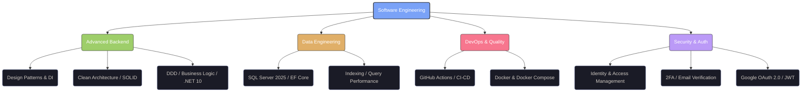

# Malcom Foca
### `Backend Engineer`
> Based in Rosario, Argentina 🇦🇷

_"Merging academic engineering with modern .NET development. Focused on Scalable Architecture, Infrastructure, and Clean Code."_

---

## 🧠 Engineering Ecosystem

# Malcom Foca
### `Backend Engineer` & `Associate Degree in Programming` 
> Based in Rosario, Argentina 🇦🇷

_"Merging academic engineering with modern .NET development. Focused on Scalable Architecture, Infrastructure, and Clean Code."_

---

## 🧠 Engineering Ecosystem

> 🛠 Tech Stack: `.NET 10` • `Next.js 15` • `SQL Server 2025` • `Docker` • `Clean Architecture`

---

## 📂 Repository Manifest
### [AuthMotion - Enterprise IAM System](https://github.com/m4lcom/AuthMotion)
- Role: `Lead Backend Engineer` | Status: `Production Ready`

- A robust Identity and Access Management (IAM) API designed for high-security environments.

- Security: Implements `JWT` with `Refresh Tokens` (HttpOnly), `2FA`, Email Verification, and Google `OAuth 2.0`.

- Resilience: Built-in `Rate Limiting` and Centralized Exception Handling (RFC 7807) under `Clean Architecture`.

- Stack: `.NET 10` • `SQL Server 2025` • `Docker` • `xUnit` • `FluentValidation`

### [Nur - Aesthetic Center Platform](https://github.com/m4lcom/aesthetic-center-front)
- Role: `Fullstack Implementation` | Status: `Production` A modern web platform for an aesthetic clinic, focusing on UX and performance.

- Frontend: Built with Next.js 15 and Tailwind CSS for a high-fidelity interface.

- Tech: Component-based architecture and responsive design strategies.

- Stack: `Next.js` • `TypeScript` • `React` • `TailwindCSS`

### [SmartWalletBackend](https://github.com/m4lcom/SmartWalletBackend)
- Role: `Backend Developer` | Status: `Active` A digital banking ecosystem designed with Clean Architecture.

- Logic: Implements complex transactional logic and security standards.

- Architecture: Separation of concerns based on systemic analysis.

- Stack: `.NET 8` • `CQRS` • `SQL Server` • `JWT`

### [EcommercePerfumesAPI](https://github.com/m4lcom/ecommercePerfumesAPI)
- Role: `Backend Developer` | Status: `Stable` High-performance RESTful API applying Microservices concepts.

- Infra: Containerized utilizing Docker for consistent environments.

- Data: Optimized queries and relational modeling.

- Stack: `ASP.NET Core` • `PostgreSQL` • `Docker` • `Linux Env`

---

### 📊 Technical Snapshot

  
  
  

---

### 📟 Professional Uplink
- `E-MAIL` malcom.foca@gmail.com
- `LINKEDIN` [linkedin.com/in/malcom-foca](https://www.linkedin.com/in/malcom-foca/)
