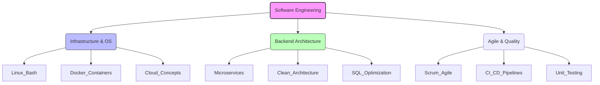

# Malcom Foca
### `Backend Developer` & `Associate Degree in Programming`
> Based in Rosario, Argentina 🇦🇷

_"Merging academic engineering with modern .NET development. Focused on Scalable Architecture, Infrastructure, and Clean Code."_

---

## 🧠 Engineering Ecosystem

> 🛠 Tech Stack & Tools
> 🧱 Backend & Core
> 🎨 Frontend & Web
> ⚙️ Infrastructure & DevOps

---

## 📂 Repository Manifest
### [Nur - Aesthetic Center Platform](https://github.com/m4lcom/aesthetic-center-front)
- Role: `Fullstack Implementation` | Status: `Active Development` A modern web platform for an aesthetic clinic, focusing on UX and performance.

- Frontend: Built with Next.js 15 and Tailwind CSS for a high-fidelity interface.

- Tech: Component-based architecture and responsive design strategies.

- Stack: `Next.js` • `TypeScript` • `React` • `TailwindCSS`

### [SmartWalletBackend](https://github.com/m4lcom/SmartWalletBackend)
- Role: `Backend Developer` | Status: `Active` A digital banking ecosystem designed with Clean Architecture.

- Logic: Implements complex transactional logic and security standards.

- Architecture: Separation of concerns based on systemic analysis.

- Stack: `.NET 8` • `CQRS` • `SQL Server` • `JWT`

### [EcommercePerfumesAPI](https://github.com/m4lcom/ecommercePerfumesAPI)
- Role: `Backend Developer` | Status: `Stable` High-performance RESTful API applying Microservices concepts.

- Infra: Containerized utilizing Docker for consistent environments.

- Data: Optimized queries and relational modeling.

- Stack: `ASP.NET Core` • `PostgreSQL` • `Docker` • `Linux Env`

---

### 📊 Performance Metrics
- 
- 

---

### 📟 Professional Uplink
- `E-MAIL` malcom.foca@gmail.com
- `LINKEDIN` [linkedin.com/in/malcom-foca](https://www.linkedin.com/in/malcom-foca/)
